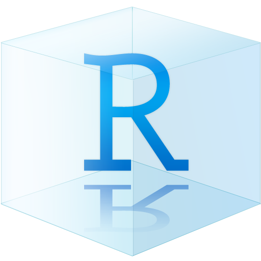

# Alfred preferences

My settings and workflows for [Alfred](https://www.alfredapp.com/) since [syncing can be finicky](https://www.alfredapp.com/help/advanced/sync/#second-mac) and [iCloud and Google Drive aren't recommended](https://www.alfredapp.com/help/advanced/sync/#services). Plus [workflows are awesome](https://www.alfredapp.com/workflows/) and get even better with version control.

Enjoy! 🎩

## Workflows

| | Workflow | Version | Author | Description |
|-|-|-|-|-|
| </img> | To Reminders notebook | 1.0.0 | Jon Dayley | Captures text in a Reminders list |
| </img> | Anki Media | 1.0.0 | Jon Dayley | Shows the Anki media folder |
| </img> | Open in Visual Studio Code | 1.0.0 | Jon Dayley | Lists repos and opens selection in Visual Studio Code |
| </img> | Open in RStudio | 1.0.0 | Jon Dayley | Lists repos that have associated R projects and opens selection in RStudio |
| </img> | LEGO categorizer | 1.0.0 | Jon Dayley | Categorizes LEGO parts |
| </img> | SigningSavvy SRC → Link | 1.0.0 | Jon Dayley | Turns video source from SigningSavvy.com into a usable link |
| </img> | Reset Launchpad | 1.0.0 | Jon Dayley | Resets the Launchpad layout |
