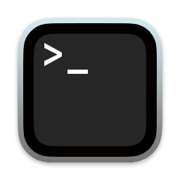
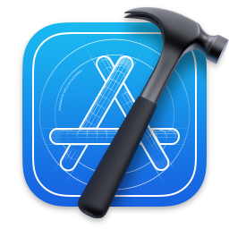

# Alfred preferences

My [settings](https://www.alfredapp.com/help/advanced/) and [workflows](https://www.alfredapp.com/workflows/) for [Alfred](https://www.alfredapp.com/) (bowtie not required 🎩).

## Workflows

| | Workflow | Version | Author | Description | Link |
|-|-|-|-|-|-|
| </img> | **Open Captive Portal** |  | [Jon Dayley](https://github.com/cadnza) | Opens captive portals when macOS fails to | [Download](exports/com.cadnza.openCaptivePortal.alfredworkflow) |
| </img> | **Restart Dictation** | `1.0.0` | [Jon Dayley](https://github.com/cadnza) | Restarts the dictation service [*More info*](details/com.cadnza.alfredRestartDictation.md) | [Download](exports/com.cadnza.alfredRestartDictation.alfredworkflow) |
| </img> | **Man Page Opener** | `1.0.1` | [Jon Dayley](https://github.com/cadnza) | Opens man pages in Terminal [*More info*](details/com.cadnza.alfredManPageOpener.md) | [Download](exports/com.cadnza.alfredManPageOpener.alfredworkflow) |
| </img> | **To Reminders notebook** | `1.0.0` | [Jon Dayley](https://github.com/cadnza) | Captures text in a Reminders list [*More info*](details/com.cadnza.alfredToRemindersNotebook.md) | [Download](exports/com.cadnza.alfredToRemindersNotebook.alfredworkflow) |
| </img> | **Russian Copy** | `1.0.0` | [Jon Dayley](https://www.github.com/cadnza) | Copies Russian text to the clipboard [*More info*](details/com.cadnza.russianCopy.md) | [Download](exports/com.cadnza.russianCopy.alfredworkflow) |
| </img> | **Little Interest Calculator** | `1.0.0` | [Jon Dayley](https://github.com/cadnza) | Does one-off interest calculations [*More info*](details/com.cadnza.littleinterestcalculator.md) | [Download](exports/com.cadnza.littleinterestcalculator.alfredworkflow) |
| </img> | **Github Clone** | `1.1.1` | [Jon Dayley](https://github.com/cadnza) | Clones repos from Github (pretty good at it, too) [*More info*](details/com.cadnza.githubclone.md) | [Download](exports/com.cadnza.githubclone.alfredworkflow) |
| </img> | **Open in Visual Studio Code** | `1.3.0` | [Jon Dayley](https://github.com/cadnza) | Lists repos and opens selection in Visual Studio Code [*More info*](details/com.cadnza.alfredOpenInVScode.md) | [Download](exports/com.cadnza.alfredOpenInVScode.alfredworkflow) |
| </img> | **Open Steam app** | `1.0.0` | [Jon Dayley](https://github.com/cadnza) | Opens apps installed with Steam [*More info*](details/com.cadnza.openSteamApp.md) | [Download](exports/com.cadnza.openSteamApp.alfredworkflow) |
| </img> | **Open in Xcode** | `1.0.0` | [Jon Dayley](https://github.com/cadnza) | Lists repos and opens selection in Xcode [*More info*](details/com.cadnza.alfredOpenInXcode.md) | [Download](exports/com.cadnza.alfredOpenInXcode.alfredworkflow) |
| </img> | **Open in RStudio** | `1.2.0` | [Jon Dayley](https://github.com/cadnza) | Lists repos that have associated R projects and opens selection in RStudio [*More info*](details/com.cadnza.alfredOpenInRStudio.md) | [Download](exports/com.cadnza.alfredOpenInRStudio.alfredworkflow) |
| </img> | **LEGO categorizer** | `1.2.0` | [Jon Dayley](https://github.com/cadnza) | Categorizes LEGO parts [*More info*](details/com.cadnza.alfredLegoCategorizer.md) | [Download](exports/com.cadnza.alfredLegoCategorizer.alfredworkflow) |
| </img> | **Bookmarks** | `1.0.0` | [Jon Dayley](https://github.com/cadnza) | Opens bookmarks created with [bookmarks](github.com/cadnza/bookmarks) [*More info*](details/com.cadnza.alfredBookmarks.md) | [Download](exports/com.cadnza.alfredBookmarks.alfredworkflow) |
| </img> | **SigningSavvy SRC → Link** | `1.0.0` | [Jon Dayley](https://github.com/cadnza) | Turns video source from SigningSavvy.com into a usable link [*More info*](details/com.cadnza.alfredSigningSavvyToLink.md) | [Download](exports/com.cadnza.alfredSigningSavvyToLink.alfredworkflow) |
| </img> | **Reset Launchpad** | `1.0.0` | [Jon Dayley](https://github.com/cadnza) | Resets the Launchpad layout [*More info*](details/com.cadnza.alfredResetLaunchpad.md) | [Download](exports/com.cadnza.alfredResetLaunchpad.alfredworkflow) |
| </img> | **Throw a wrench at iCloud** | `1.0.0` | [Jon Dayley](https://github.com/cadnza) | Throws a wrench at iCloud [*More info*](details/com.cadnza.alfredThrowWrenchAtiCloud.md) | [Download](exports/com.cadnza.alfredThrowWrenchAtiCloud.alfredworkflow) |
