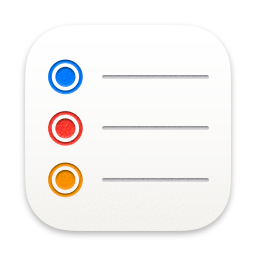

# Alfred preferences

My settings and workflows for [Alfred](https://www.alfredapp.com/) since [syncing can be finicky](https://www.alfredapp.com/help/advanced/sync/#second-mac) and [iCloud and Google Drive aren't recommended](https://www.alfredapp.com/help/advanced/sync/#services). Plus [workflows are awesome](https://www.alfredapp.com/workflows/) and get even better with version control.

Enjoy! 🎩

## Workflows

| | Workflow | Version | Author | Description |
|-|-|-|-|-|
| </img> | **To Reminders notebook** | `1.0.0` | Jon Dayley | Captures text in a Reminders list |
| </img> | **Anki Media** | `1.0.0` | Jon Dayley | Shows the Anki media folder |
| </img> | **Open in Visual Studio Code** | `1.0.0` | Jon Dayley | Lists repos and opens selection in Visual Studio Code |
|  | **Testing** | `` |  |  |
| </img> | **Open in RStudio** | `1.0.0` | Jon Dayley | Lists repos that have associated R projects and opens selection in RStudio |
| </img> | **LEGO categorizer** | `1.0.0` | Jon Dayley | Categorizes LEGO parts |
| </img> | **SigningSavvy SRC → Link** | `1.0.0` | Jon Dayley | Turns video source from SigningSavvy.com into a usable link |
| </img> | **Reset Launchpad** | `1.0.0` | Jon Dayley | Resets the Launchpad layout |
