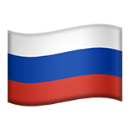
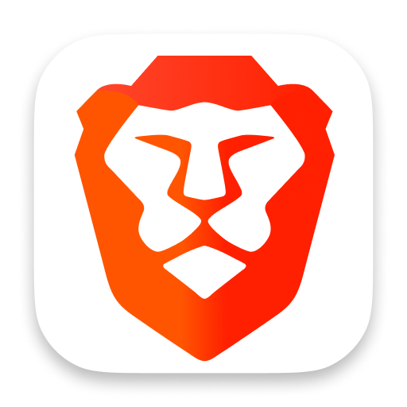
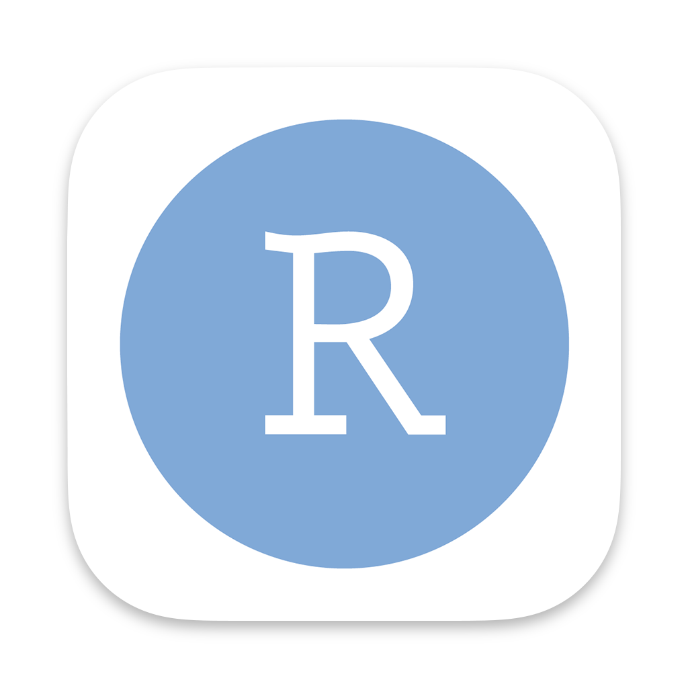
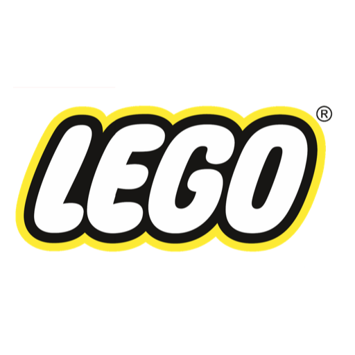

# Alfred preferences

My [settings](https://www.alfredapp.com/help/advanced/) and [workflows](https://www.alfredapp.com/workflows/) for [Alfred](https://www.alfredapp.com/) (bowtie not required 🎩).

## Workflows

| | Workflow | Version | Author | Description | Link |
|-|-|-|-|-|-|
| </img> | **Restart Dictation** | `1.0.0` | [Jon Dayley](https://github.com/cadnza) | Restarts the dictation service [*More info*](details/com.jondayley.alfredRestartDictation.md) | [Download](exports/com.jondayley.alfredRestartDictation.alfredworkflow) |
| </img> | **To Reminders notebook** | `1.0.0` | [Jon Dayley](https://github.com/cadnza) | Captures text in a Reminders list [*More info*](details/com.jondayley.alfredToRemindersNotebook.md) | [Download](exports/com.jondayley.alfredToRemindersNotebook.alfredworkflow) |
| </img> | **Russian Copy** | `1.0.0` | [Jon Dayley](https://www.github.com/cadnza) | Copies Russian text to the clipboard [*More info*](details/com.jondayley.russianCopy.md) | [Download](exports/com.jondayley.russianCopy.alfredworkflow) |
| </img> | **Brave Bookmarks** | `1.0.2` | [Jon Dayley](https://github.com/cadnza) | Opens bookmarks from the Brave browser [*More info*](details/com.jondayley.alfredBraveBookmarks.md) | [Download](exports/com.jondayley.alfredBraveBookmarks.alfredworkflow) |
| </img> | **Github Clone** | `1.1.1` | [Jon Dayley](https://github.com/cadnza) | Clones repos from Github (pretty good at it, too) [*More info*](details/com.jondayley.githubclone.md) | [Download](exports/com.jondayley.githubclone.alfredworkflow) |
| </img> | **Anki Media** | `1.0.0` | [Jon Dayley](https://github.com/cadnza) | Shows the Anki media folder [*More info*](details/com.jondayley.alfredAmedia.md) | [Download](exports/com.jondayley.alfredAmedia.alfredworkflow) |
| </img> | **Open in Visual Studio Code** | `1.3.0` | [Jon Dayley](https://github.com/cadnza) | Lists repos and opens selection in Visual Studio Code [*More info*](details/com.jondayley.alfredOpenInVScode.md) | [Download](exports/com.jondayley.alfredOpenInVScode.alfredworkflow) |
| </img> | **Open in RStudio** | `1.2.0` | [Jon Dayley](https://github.com/cadnza) | Lists repos that have associated R projects and opens selection in RStudio [*More info*](details/com.jondayley.alfredOpenInRStudio.md) | [Download](exports/com.jondayley.alfredOpenInRStudio.alfredworkflow) |
| </img> | **LEGO categorizer** | `1.2.0` | [Jon Dayley](https://github.com/cadnza) | Categorizes LEGO parts [*More info*](details/com.jondayley.alfredLegoCategorizer.md) | [Download](exports/com.jondayley.alfredLegoCategorizer.alfredworkflow) |
| </img> | **SigningSavvy SRC → Link** | `1.0.0` | [Jon Dayley](https://github.com/cadnza) | Turns video source from SigningSavvy.com into a usable link [*More info*](details/com.jondayley.alfredSigningSavvyToLink.md) | [Download](exports/com.jondayley.alfredSigningSavvyToLink.alfredworkflow) |
| </img> | **Reset Launchpad** | `1.0.0` | [Jon Dayley](https://github.com/cadnza) | Resets the Launchpad layout [*More info*](details/com.jondayley.alfredResetLaunchpad.md) | [Download](exports/com.jondayley.alfredResetLaunchpad.alfredworkflow) |
